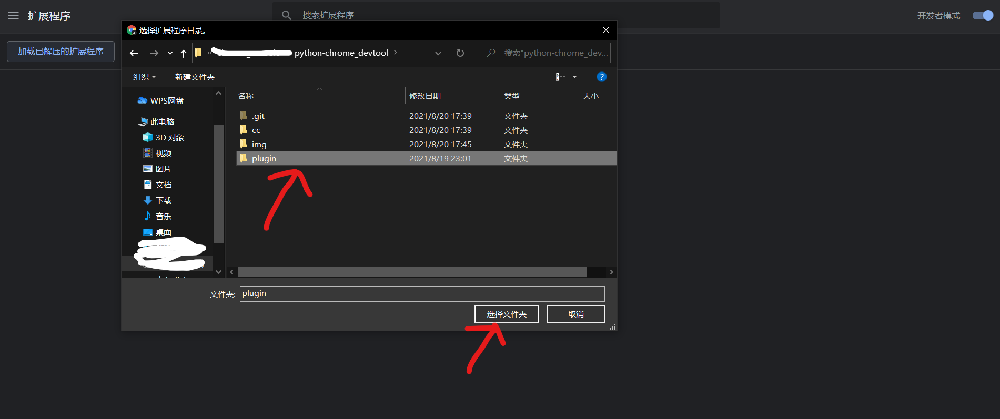

## Through chrome plug-in enables local execution of web scripts and printing of execution results

### Function demo

execute local chrome_console.py

type in javascript code and push enter

return execute result

execute environment is just as same as chrome devtool environment

### install develop chrome extension

open developer mode

click to install develop chrome extension

choose plugin directory

copy cc_plugin ID

paste ID to ID.txt

save ID.txt

double click setup_cc.bat to complete local configuration

clear error

click refresh button

no error occur indicate install complete

PS: plugin can not execute in chrome plugin page please use this demo in really web page